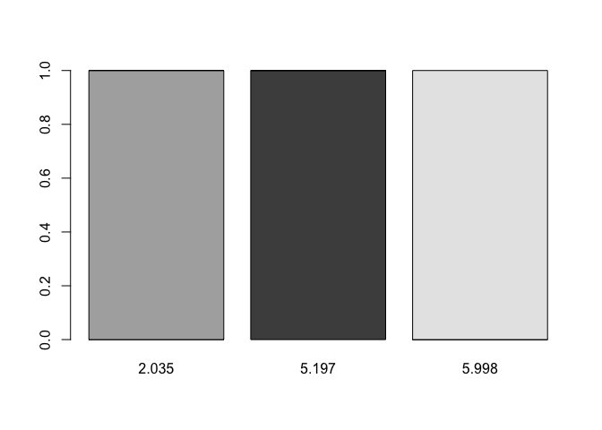
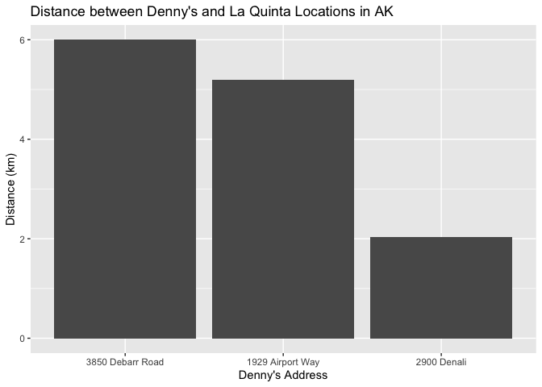
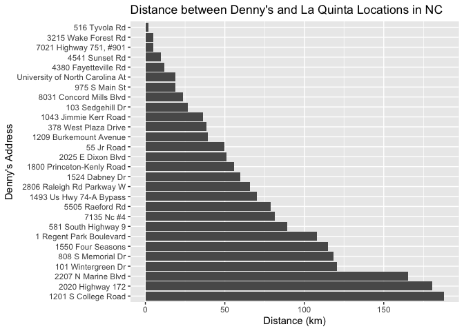
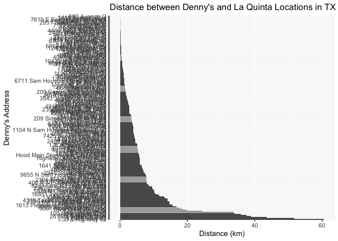
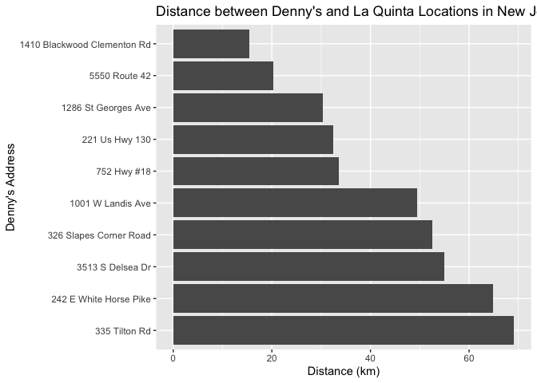

Lab 05 - Wrangling Spatial Data
================
Lilly McClendon
02-21-2025

### Load packages and data

``` r
library(tidyverse) 
library(dsbox) 
```

``` r
states <- read_csv("data/states.csv")
```

### Exercise 1

``` r
view(dennys)
view(laquinta)
```

``` r
dn_ak <- dennys %>%
  filter(state == "AK")
nrow(dn_ak)
```

    ## [1] 3

``` r
view(dn_ak)
```

``` r
lq_ak <- laquinta %>%
  filter(state == "AK")
nrow(lq_ak)
```

    ## [1] 2

``` r
view(lq_ak)
```

### Exercise 2

#### Total combinations of Denny’s and La Quinta Locations

``` r
total_combinations <- nrow(dn_ak) * nrow(lq_ak)
print(total_combinations)
```

    ## [1] 6

There are 6 total combinations of Denny’s and La Quinta locations in
Alaska.

### Exercise 3

#### Joining Denny’s in Alaska and La Quinta in Alaska datasets

``` r
dn_lq_ak <- full_join(dn_ak, lq_ak, 
                      by = "state")
```

    ## Warning in full_join(dn_ak, lq_ak, by = "state"): Detected an unexpected many-to-many relationship between `x` and `y`.
    ## ℹ Row 1 of `x` matches multiple rows in `y`.
    ## ℹ Row 1 of `y` matches multiple rows in `x`.
    ## ℹ If a many-to-many relationship is expected, set `relationship =
    ##   "many-to-many"` to silence this warning.

``` r
dn_lq_ak
```

    ## # A tibble: 6 × 11
    ##   address.x     city.x state zip.x longitude.x latitude.x address.y city.y zip.y
    ##   <chr>         <chr>  <chr> <chr>       <dbl>      <dbl> <chr>     <chr>  <chr>
    ## 1 2900 Denali   Ancho… AK    99503       -150.       61.2 3501 Min… "\nAn… 99503
    ## 2 2900 Denali   Ancho… AK    99503       -150.       61.2 4920 Dal… "\nFa… 99709
    ## 3 3850 Debarr … Ancho… AK    99508       -150.       61.2 3501 Min… "\nAn… 99503
    ## 4 3850 Debarr … Ancho… AK    99508       -150.       61.2 4920 Dal… "\nFa… 99709
    ## 5 1929 Airport… Fairb… AK    99701       -148.       64.8 3501 Min… "\nAn… 99503
    ## 6 1929 Airport… Fairb… AK    99701       -148.       64.8 4920 Dal… "\nFa… 99709
    ## # ℹ 2 more variables: longitude.y <dbl>, latitude.y <dbl>

### Exercise 4

``` r
library(dplyr)
count(dn_lq_ak)
```

    ## # A tibble: 1 × 1
    ##       n
    ##   <int>
    ## 1     6

``` r
colnames(dn_lq_ak)
```

    ##  [1] "address.x"   "city.x"      "state"       "zip.x"       "longitude.x"
    ##  [6] "latitude.x"  "address.y"   "city.y"      "zip.y"       "longitude.y"
    ## [11] "latitude.y"

#### Number of observations in joined dn_lq_ak data frame

There are 6 observations in the joined dn_lq_ak data frame, which
matches up with the number of total combinations (6) we calculated.

#### Names of variables in joined dn_lq_ak data frame

The names of the variables in the joined dn_lq_ak data frame are
address.x, city.x, state, zip.x, longitude.x, latitude.x, address.y,
city.y, zip.y, longitude.y, and latitude.y.

### Exercise 5

#### Tidyverse function to add a new variable to data frame while keeping existing variables

The mutate function in Tidyverse can be used to add a new variable to a
data frame while keeping the existing variables.

``` r
haversine <- function(long1, lat1, long2, lat2, round = 3) {
  # convert to radians
  long1 <- long1 * pi / 180
  lat1 <- lat1 * pi / 180
  long2 <- long2 * pi / 180
  lat2 <- lat2 * pi / 180

  R <- 6371 # Earth mean radius in km

  a <- sin((lat2 - lat1) / 2)^2 + cos(lat1) * cos(lat2) * sin((long2 - long1) / 2)^2
  d <- R * 2 * asin(sqrt(a))

  return(round(d, round)) # distance in km
}
```

### Exercise 6

``` r
dn_lq_ak <- dn_lq_ak %>%
  mutate(distance = haversine(longitude.x, latitude.x, longitude.y, latitude.y, round = 3))
```

### Exercise 7

``` r
dn_lq_ak_mindist <- dn_lq_ak %>%
  group_by(address.x) %>%
  summarize(closest = min(distance))
```

### Exercise 8

``` r
summary(dn_lq_ak_mindist)
```

    ##   address.x            closest     
    ##  Length:3           Min.   :2.035  
    ##  Class :character   1st Qu.:3.616  
    ##  Mode  :character   Median :5.197  
    ##                     Mean   :4.410  
    ##                     3rd Qu.:5.598  
    ##                     Max.   :5.998

``` r
IQR(dn_lq_ak_mindist$closest)
```

    ## [1] 1.9815

``` r
table <- table(dn_lq_ak_mindist)
print(table)
```

    ##                   closest
    ## address.x          2.035 5.197 5.998
    ##   1929 Airport Way     0     1     0
    ##   2900 Denali          1     0     0
    ##   3850 Debarr Road     0     0     1

``` r
barplot(table)
```

<!-- -->

``` r
IQR_ak <- 1.982 
quart1_ak <- 3.616 
quart3_ak <- 5.598 
print(quart1_ak - (IQR_ak*1.5))
```

    ## [1] 0.643

``` r
print(quart3_ak + (IQR_ak*1.5))
```

    ## [1] 8.571

#### Description of the distribution of the distances between a Denny’s and La Quinta for each Denny’s location in Alaska.

The IQR method for identifying outliers has determined that none of the
three minimum distances between a Denny’s and La Quinta are outliers.
The distances range from 2.035 to 5. 998, with the average distance
equaling 4.410 and a median of 5.197.

``` r
ggplot(dn_lq_ak_mindist, aes(x = forcats::fct_reorder(address.x, desc(closest)), y = closest)) + 
  geom_col() + 
  labs(
    title = "Distance between Denny's and La Quinta Locations in AK",
    x = "Denny's Address",
    y = "Distance (km)"
  )
```

<!-- -->

### Exercise 9

``` r
dn_nc <- dennys %>%
  filter(state == "NC")
nrow(dn_nc)
```

    ## [1] 28

``` r
view(dn_nc)
```

``` r
lq_nc <- laquinta %>%
  filter(state == "NC")
nrow(lq_nc)
```

    ## [1] 12

``` r
view(lq_nc)
```

``` r
total_combinations_nc <- nrow(dn_nc) * nrow(lq_nc)
print(total_combinations_nc)
```

    ## [1] 336

There are 336 total combinations of Denny’s and La Quinta locations in
Texas.

``` r
dn_lq_nc <- full_join(dn_nc, lq_nc, 
                      by = "state")
```

    ## Warning in full_join(dn_nc, lq_nc, by = "state"): Detected an unexpected many-to-many relationship between `x` and `y`.
    ## ℹ Row 1 of `x` matches multiple rows in `y`.
    ## ℹ Row 1 of `y` matches multiple rows in `x`.
    ## ℹ If a many-to-many relationship is expected, set `relationship =
    ##   "many-to-many"` to silence this warning.

``` r
dn_lq_nc
```

    ## # A tibble: 336 × 11
    ##    address.x    city.x state zip.x longitude.x latitude.x address.y city.y zip.y
    ##    <chr>        <chr>  <chr> <chr>       <dbl>      <dbl> <chr>     <chr>  <chr>
    ##  1 1 Regent Pa… Ashev… NC    28806       -82.6       35.6 165 Hwy … "\nBo… 28607
    ##  2 1 Regent Pa… Ashev… NC    28806       -82.6       35.6 3127 Slo… "\nCh… 28208
    ##  3 1 Regent Pa… Ashev… NC    28806       -82.6       35.6 4900 Sou… "\nCh… 28217
    ##  4 1 Regent Pa… Ashev… NC    28806       -82.6       35.6 4414 Dur… "\nDu… 27707
    ##  5 1 Regent Pa… Ashev… NC    28806       -82.6       35.6 1910 Wes… "\nDu… 27713
    ##  6 1 Regent Pa… Ashev… NC    28806       -82.6       35.6 1201 Lan… "\nGr… 27407
    ##  7 1 Regent Pa… Ashev… NC    28806       -82.6       35.6 1607 Fai… "\nCo… 28613
    ##  8 1 Regent Pa… Ashev… NC    28806       -82.6       35.6 191 Cres… "\nCa… 27518
    ##  9 1 Regent Pa… Ashev… NC    28806       -82.6       35.6 2211 Sum… "\nRa… 27612
    ## 10 1 Regent Pa… Ashev… NC    28806       -82.6       35.6 1001 Aer… "\nMo… 27560
    ## # ℹ 326 more rows
    ## # ℹ 2 more variables: longitude.y <dbl>, latitude.y <dbl>

``` r
library(dplyr)
count(dn_lq_nc)
```

    ## # A tibble: 1 × 1
    ##       n
    ##   <int>
    ## 1   336

``` r
colnames(dn_lq_nc)
```

    ##  [1] "address.x"   "city.x"      "state"       "zip.x"       "longitude.x"
    ##  [6] "latitude.x"  "address.y"   "city.y"      "zip.y"       "longitude.y"
    ## [11] "latitude.y"

``` r
dn_lq_nc <- dn_lq_nc %>%
  mutate(distance = haversine(longitude.x, latitude.x, longitude.y, latitude.y, round = 3))
```

``` r
dn_lq_nc_mindist <- dn_lq_nc %>%
  group_by(address.x) %>%
  summarize(closest = min(distance))
```

``` r
summary(dn_lq_nc_mindist)
```

    ##   address.x            closest       
    ##  Length:28          Min.   :  1.779  
    ##  Class :character   1st Qu.: 22.388  
    ##  Mode  :character   Median : 53.456  
    ##                     Mean   : 65.444  
    ##                     3rd Qu.: 93.985  
    ##                     Max.   :187.935

``` r
IQR(dn_lq_nc_mindist$closest)
```

    ## [1] 71.597

``` r
table <- table(dn_lq_nc_mindist)
```

``` r
IQR_nc <- 71.597 
quart1_nc <- 22.388
quart3_nc <- 93.985
print(quart1_nc - (IQR_nc*1.5))
```

    ## [1] -85.0075

``` r
print(quart3_nc + (IQR_nc*1.5))
```

    ## [1] 201.3805

#### Description of the distribution of the distances between a Denny’s and La Quinta for each Denny’s location in North Carolina.

The IQR method for identifying outliers has determined that none of the
28 minimum distances between a Denny’s and La Quinta are outliers in
North Carolina. The distances range from 1.779 to 187.935, with the
average distance equaling 65.444 and a median of 53.456.

``` r
ggplot(dn_lq_nc_mindist, aes(x = forcats::fct_reorder(address.x, desc(closest)), y = closest)) + 
  geom_col() + 
  labs(
    title = "Distance between Denny's and La Quinta Locations in NC",
    x = "Denny's Address",
    y = "Distance (km)"
  ) + 
  coord_flip()
```

<!-- -->

### Exercise 10

``` r
dn_tx <- dennys %>%
  filter(state == "TX")
nrow(dn_tx)
```

    ## [1] 200

``` r
view(dn_tx)
```

``` r
lq_tx <- laquinta %>%
  filter(state == "TX")
nrow(lq_tx)
```

    ## [1] 237

``` r
view(lq_tx)
```

#### Total combinations of Denny’s and La Quinta Locations in Texas

``` r
total_combinations_tx <- nrow(dn_tx) * nrow(lq_tx)
print(total_combinations_tx)
```

    ## [1] 47400

There are 47,400 total combinations of Denny’s and La Quinta locations
in Texas.

#### Joining Denny’s in Texas and La Quinta in Texas datasets

``` r
dn_lq_tx <- full_join(dn_tx, lq_tx, 
                      by = "state")
```

    ## Warning in full_join(dn_tx, lq_tx, by = "state"): Detected an unexpected many-to-many relationship between `x` and `y`.
    ## ℹ Row 1 of `x` matches multiple rows in `y`.
    ## ℹ Row 1 of `y` matches multiple rows in `x`.
    ## ℹ If a many-to-many relationship is expected, set `relationship =
    ##   "many-to-many"` to silence this warning.

``` r
dn_lq_tx
```

    ## # A tibble: 47,400 × 11
    ##    address.x    city.x state zip.x longitude.x latitude.x address.y city.y zip.y
    ##    <chr>        <chr>  <chr> <chr>       <dbl>      <dbl> <chr>     <chr>  <chr>
    ##  1 120 East I-… Abile… TX    79601       -99.6       32.4 3018 Cat… "\nAb… 79606
    ##  2 120 East I-… Abile… TX    79601       -99.6       32.4 3501 Wes… "\nAb… 79601
    ##  3 120 East I-… Abile… TX    79601       -99.6       32.4 14925 La… "\nAd… 75254
    ##  4 120 East I-… Abile… TX    79601       -99.6       32.4 909 East… "\nAl… 78516
    ##  5 120 East I-… Abile… TX    79601       -99.6       32.4 2400 Eas… "\nAl… 78332
    ##  6 120 East I-… Abile… TX    79601       -99.6       32.4 1220 Nor… "\nAl… 75013
    ##  7 120 East I-… Abile… TX    79601       -99.6       32.4 1165 Hwy… "\nAl… 76009
    ##  8 120 East I-… Abile… TX    79601       -99.6       32.4 880 Sout… "\nAl… 77511
    ##  9 120 East I-… Abile… TX    79601       -99.6       32.4 1708 Int… "\nAm… 79103
    ## 10 120 East I-… Abile… TX    79601       -99.6       32.4 9305 Eas… "\nAm… 79118
    ## # ℹ 47,390 more rows
    ## # ℹ 2 more variables: longitude.y <dbl>, latitude.y <dbl>

``` r
library(dplyr)
count(dn_lq_tx)
```

    ## # A tibble: 1 × 1
    ##       n
    ##   <int>
    ## 1 47400

``` r
colnames(dn_lq_tx)
```

    ##  [1] "address.x"   "city.x"      "state"       "zip.x"       "longitude.x"
    ##  [6] "latitude.x"  "address.y"   "city.y"      "zip.y"       "longitude.y"
    ## [11] "latitude.y"

#### Number of observations in joined dn_lq_tx data frame

There are 47,400 observations in the joined dn_lq_ak data frame, which
matches up with the number of total combinations (47,400) we calculated.

#### Names of variables in joined dn_lq_tx data frame

The names of the variables in the joined dn_lq_tx data frame are
address.x, city.x, state, zip.x, longitude.x, latitude.x, address.y,
city.y, zip.y, longitude.y, and latitude.y.

``` r
dn_lq_tx <- dn_lq_tx %>%
  mutate(distance = haversine(longitude.x, latitude.x, longitude.y, latitude.y, round = 3))
```

``` r
dn_lq_tx_mindist <- dn_lq_tx %>%
  group_by(address.x) %>%
  summarize(closest = min(distance)) 
dn_lq_tx_mindist[order(dn_lq_tx_mindist$closest, decreasing= TRUE),]
```

    ## # A tibble: 200 × 2
    ##    address.x             closest
    ##    <chr>                   <dbl>
    ##  1 I-30 & Highway 82        60.6
    ##  2 4756 E Hwy 83            51.8
    ##  3 1058 Us 59 S             43.4
    ##  4 2615 N Stallings Dr N    38.9
    ##  5 10367 Highway 59         37.6
    ##  6 17400 N Hwy 20           35.9
    ##  7 100 Us Highway 79 S      33.9
    ##  8 100 Cottonwood           33.6
    ##  9 11710 Ih 35              24.4
    ## 10 1201 Hwy 146 N           19.9
    ## # ℹ 190 more rows

``` r
summary(dn_lq_tx_mindist)
```

    ##   address.x            closest       
    ##  Length:200         Min.   : 0.0160  
    ##  Class :character   1st Qu.: 0.7305  
    ##  Mode  :character   Median : 3.3715  
    ##                     Mean   : 5.7918  
    ##                     3rd Qu.: 6.6303  
    ##                     Max.   :60.5820

``` r
IQR(dn_lq_tx_mindist$closest)
```

    ## [1] 5.89975

``` r
table <- table(dn_lq_tx_mindist)
```

``` r
IQR_tx <- 5.89975
quart1_tx <- 0.7305 
quart3_tx <- 6.6303 
print(quart1_tx - (IQR_tx*1.5))
```

    ## [1] -8.119125

``` r
print(quart3_tx + (IQR_tx*1.5))
```

    ## [1] 15.47992

#### Description of the distribution of the distances between a Denny’s and La Quinta for each Denny’s location.

The IQR method for identifying outliers has determined that 14 of the
200 minimum distances between a Denny’s and La Quinta are outliers in
Texas. The distances range from 0.0160 to 60.5820 with the average
distance equaling 5.7918 and a median of 3.3715.

``` r
ggplot(dn_lq_tx_mindist, aes(x = forcats::fct_reorder(address.x, desc(closest)), y = closest)) + 
  geom_col() + 
  labs(
    title = "Distance between Denny's and La Quinta Locations in TX",
    x = "Denny's Address",
    y = "Distance (km)"
  ) +
coord_flip()
```

<!-- -->

### Exercise 11

``` r
dn_nj <- dennys %>%
  filter(state == "NJ")
nrow(dn_nj)
```

    ## [1] 10

``` r
view(dn_nj)
```

``` r
lq_nj <- laquinta %>%
  filter(state == "NJ")
nrow(lq_nj)
```

    ## [1] 5

``` r
view(lq_nj)
```

``` r
total_combinations_nj <- nrow(dn_nj) * nrow(lq_nj)
print(total_combinations_nj)
```

    ## [1] 50

``` r
dn_lq_nj <- full_join(dn_nj, lq_nj, 
                      by = "state")
```

    ## Warning in full_join(dn_nj, lq_nj, by = "state"): Detected an unexpected many-to-many relationship between `x` and `y`.
    ## ℹ Row 1 of `x` matches multiple rows in `y`.
    ## ℹ Row 1 of `y` matches multiple rows in `x`.
    ## ℹ If a many-to-many relationship is expected, set `relationship =
    ##   "many-to-many"` to silence this warning.

``` r
dn_lq_nj
```

    ## # A tibble: 50 × 11
    ##    address.x    city.x state zip.x longitude.x latitude.x address.y city.y zip.y
    ##    <chr>        <chr>  <chr> <chr>       <dbl>      <dbl> <chr>     <chr>  <chr>
    ##  1 1286 St Geo… Avenel NJ    07001       -74.3       40.6 265 Rte … "\nCl… 07014
    ##  2 1286 St Geo… Avenel NJ    07001       -74.3       40.6 38 Two B… "\nFa… 07004
    ##  3 1286 St Geo… Avenel NJ    07001       -74.3       40.6 5000 Clo… "\nMo… 08054
    ##  4 1286 St Geo… Avenel NJ    07001       -74.3       40.6 350 Ligh… "\nSe… 07094
    ##  5 1286 St Geo… Avenel NJ    07001       -74.3       40.6 109 Rout… "\nWe… 07764
    ##  6 221 Us Hwy … Borde… NJ    08505       -74.7       40.1 265 Rte … "\nCl… 07014
    ##  7 221 Us Hwy … Borde… NJ    08505       -74.7       40.1 38 Two B… "\nFa… 07004
    ##  8 221 Us Hwy … Borde… NJ    08505       -74.7       40.1 5000 Clo… "\nMo… 08054
    ##  9 221 Us Hwy … Borde… NJ    08505       -74.7       40.1 350 Ligh… "\nSe… 07094
    ## 10 221 Us Hwy … Borde… NJ    08505       -74.7       40.1 109 Rout… "\nWe… 07764
    ## # ℹ 40 more rows
    ## # ℹ 2 more variables: longitude.y <dbl>, latitude.y <dbl>

``` r
library(dplyr)
count(dn_lq_nj)
```

    ## # A tibble: 1 × 1
    ##       n
    ##   <int>
    ## 1    50

``` r
colnames(dn_lq_nj)
```

    ##  [1] "address.x"   "city.x"      "state"       "zip.x"       "longitude.x"
    ##  [6] "latitude.x"  "address.y"   "city.y"      "zip.y"       "longitude.y"
    ## [11] "latitude.y"

``` r
dn_lq_nj <- dn_lq_nj %>%
  mutate(distance = haversine(longitude.x, latitude.x, longitude.y, latitude.y, round = 3))
```

``` r
dn_lq_nj_mindist <- dn_lq_nj %>%
  group_by(address.x) %>%
  summarize(closest = min(distance))
```

``` r
summary(dn_lq_nj_mindist)
```

    ##   address.x            closest     
    ##  Length:10          Min.   :15.39  
    ##  Class :character   1st Qu.:30.88  
    ##  Mode  :character   Median :41.52  
    ##                     Mean   :42.29  
    ##                     3rd Qu.:54.40  
    ##                     Max.   :69.13

``` r
IQR(dn_lq_nj_mindist$closest)
```

    ## [1] 23.524

``` r
table <- table(dn_lq_nj_mindist)
```

``` r
IQR_nj <- 23.524
quart1_nj <- 30.88 
quart3_nj <- 54.40
print(quart1_nj - (IQR_nj*1.5))
```

    ## [1] -4.406

``` r
print(quart3_nj + (IQR_nj*1.5))
```

    ## [1] 89.686

#### Description of the distribution of the distances between a Denny’s and La Quinta for each Denny’s location in New Jersey

The IQR method for identifying outliers has determined that none of the
10 minimum distances between a Denny’s and La Quinta are outliers. The
distances range from 15.39 to 69.13, with the average distance equaling
42.29 and a median of 41.52.

``` r
ggplot(dn_lq_nj_mindist, aes(x = forcats::fct_reorder(address.x, desc(closest)), y = closest)) + 
  geom_col() + 
  labs(
    title = "Distance between Denny's and La Quinta Locations in NJ",
    x = "Denny's Address",
    y = "Distance (km)"
  ) +
coord_flip()
```

<!-- -->

### Exercise 12

Among the states that I looked at (Alaska, North Carolina, Texas, and
New Jersey) Mitch Hedberg’s joke is most likely to hold true is Alaska.
Among the minimum distances, the greatest distance was approximately
6km. Whereas when North Carolina, Texas and New Jersey were examined,
among the minimum distances, the greatest distances were approximately
187, 61, and 69 respectively. Although Texas has a smaller median
distance value (3.37) than Alaska (5.20), I would still assert that
Alaska is the state where Mitch Hedberg’s joke is most likely to hold
true. I think this because of the maximum distance in Alaska of
approximately 6 kilometers. In the right conditions, a person can see
roughly 5 kilometers. Therefore, in Alaska, a person would be able to
literally see a la quinta from every Denny’s location which would make
the joke seem the most plausible. In Texas, there is a much larger range
of values so there would be many occasions where there is a Denny’s
without a La Quinta close nearby.
